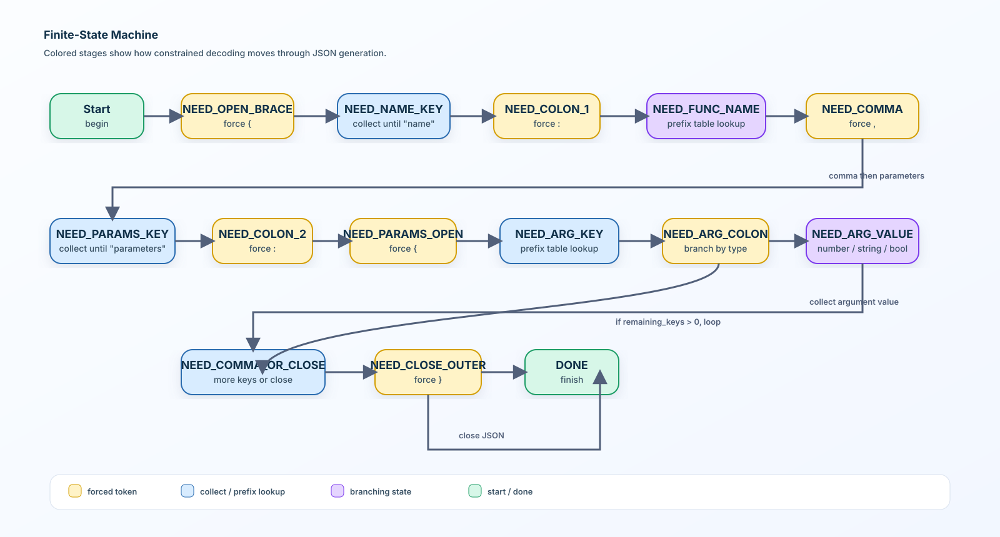

# LLM-Function-Playground

## Description

This project implements a **function calling system** for a small language model (Qwen3-0.6B, ~500M parameters). Instead of answering questions in natural language, the model produces structured JSON that describes which function to call and with what arguments.

Given a natural language prompt like `"What is the sum of 2 and 3?"`, the system outputs:

```json
{
  "prompt": "What is the sum of 2 and 3?",
  "name": "fn_add_numbers",
  "parameters": {"a": 2.0, "b": 3.0}
}
```

The core challenge is that small language models are unreliable at generating structured JSON on their own (succeeding only ~30% of the time). This project solves that using **constrained decoding** — a technique that guides the model token by token to guarantee 100% valid, schema-compliant JSON output.

---

## Algorithm Explanation

### How LLMs Generate Text

Language models generate text one token at a time. At each step, the model produces a probability distribution (logits) over every token in its vocabulary (~151,000 tokens for Qwen3). Normally the highest-scoring token is selected.

### Constrained Decoding

Constrained decoding intervenes **before** token selection at every generation step:

1. The model produces logits for all possible next tokens
2. A finite-state machine determines which tokens are valid at the current position
3. All invalid token logits are set to `-infinity` (making them impossible to select)
4. The model picks the highest-scoring token from the remaining valid ones

This guarantees that every generated token maintains both structural validity (correct JSON syntax) and semantic validity (correct schema compliance).

### The Finite-State Machine

The generation follows a strict sequence of stages defined in the `Stage` enum. Each stage controls exactly which tokens the model is allowed to generate:



After each argument is collected, the machine checks `remaining_keys`. If more arguments exist, it loops back to `NEED_QUOTE_OPEN_ARG_KEY`. Otherwise it closes the JSON object and finishes.

### Prefix Tables

To avoid scanning all 151,000 vocabulary tokens at every generation step, prefix lookup tables are precomputed at startup. For function names, parameter keys, and boolean values, the system builds a dictionary mapping every possible partial string to its valid next token IDs. During generation, valid token IDs are retrieved in O(1) time via dictionary lookup.

For example, the function name prefix table for `["fn_add_numbers", "fn_greet"]`:

```
""          → [id of "fn_", id of "fn_add", id of "fn_greet", ...]
"fn_add"    → [id of "_numbers"]
"fn_greet"  → COMPLETE
```

### Token Masking

The `mask_logits` method applies the constraints:

```python
masked = [-inf] * vocab_size
for i in valid_ids:
    masked[i] = logits[i]
```

The model then picks `argmax(masked)` — guaranteed to be a valid token.

---

## Design Decisions

**Pydantic for data validation**: All data models use Pydantic, providing automatic type validation and clear error messages when input files contain malformed data.

**`remaining_keys` set in state**: Instead of recomputing remaining argument keys at every step by diffing `used_keys` against the function definition, the state tracks `remaining_keys` directly as a set. When an argument is saved, its key is discarded from `remaining_keys` immediately. This makes the check O(1).

**`function_map` dict for O(1) lookup**: Rather than iterating through the function list to find the current function at every step, a dict `{name: FunctionDefinition}` is built at startup.

**Quote stages only for non-number types**: Number values in JSON are unquoted. The FSM branches at `NEED_ARG_COLON` — numbers go directly to `NEED_ARG_VALUE` while strings and booleans pass through `NEED_QUOTE_OPEN_ARG_VALUE` first. This produces correctly formatted JSON without quotes around numbers.

**Multi-character token termination**: The tokenizer sometimes produces tokens that contain both content and a terminator in one token (e.g. `",` or `}}`). The `update_state` method handles this by checking if the terminator character is contained anywhere in the token string, not just as an exact match.

**Double-brace detection**: When the model generates `}}` as a single token at the end of parameter generation, the state machine counts the braces and jumps directly to `DONE` instead of `NEED_CLOSE_OUTER`, avoiding an extra unnecessary generation step.

**Few-shot prompting**: The system prompt includes carefully chosen examples covering all function types. This significantly improves accuracy for complex cases like regex pattern extraction.

**Infinite loop prevention**: A per-prompt token counter breaks generation if it exceeds a maximum. When triggered, the partial value collected so far is saved and the state advances gracefully to the next stage.

**Unicode space handling**: The Qwen tokenizer encodes leading spaces as `Ġ` (`\u0120`). All collected string and number values are cleaned by replacing this character before saving.

---

## Performance Analysis

| Metric | Result |
|--------|--------|
| JSON validity | 100% — every output is parseable |
| Function selection accuracy | ~90%+ on standard prompts |
| Processing speed | Under 5 minutes for all test prompts on CPU |
| Reliability | No crashes on malformed inputs or missing files |

The system performs well on number arguments, simple string extraction, and function selection. Performance degrades for very complex regex patterns where the 0.6B model has limited generation capability. The constrained decoding guarantees structural correctness regardless of model quality.

---

## Instructions

### Installation

```bash
git clone <your-repo-url>
cd LLM-Function-Playground
uv sync
```

### Running

```bash
make run

uv run python -m src \
  --functions_definition data/input/functions_definition.json \
  --input data/input/function_calling_tests.json \
  --output data/output/function_calling_results.json
```

### Makefile Commands

```bash
make install   # install dependencies
make run       # run with default paths
make lint      # run flake8 and mypy
make clean     # remove caches and temporary files
make fclean    # remove caches and temporary files and virtual env
```

---

### Evaluation

Run the project checks and grading flow with uv:

```bash
cd moulinette
uv sync
uv run python -m moulinette prepare_exercises --set private correction_tests
cd ..
make run    # Change the --input --functions_definition with the path in the correction_tests folder
cd moulinette
uv run python -m moulinette grade_answers --set private --answer_path <path>

---

## Example Usage

**Input** (`function_calling_tests.json`):
```json
[
  {"prompt": "What is the sum of 2 and 3?"},
  {"prompt": "Greet shrek"},
  {"prompt": "Reverse the string 'hello'"}
]
```

**Output** (`function_calling_results.json`):
```json
[
  {
    "prompt": "What is the sum of 2 and 3?",
    "name": "fn_add_numbers",
    "parameters": {"a": 2.0, "b": 3.0}
  },
  {
    "prompt": "Greet shrek",
    "name": "fn_greet",
    "parameters": {"name": "shrek"}
  },
  {
    "prompt": "Reverse the string 'hello'",
    "name": "fn_reverse_string",
    "parameters": {"s": "hello"}
  }
]
```